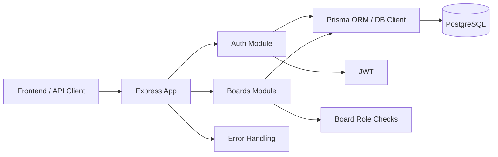

# SyncBoard Server Architecture

> Current-state documentation for the backend. This file describes what is actually implemented in the repository, not the full planned product.

## 1. Current Status

The server currently provides:

- Express + TypeScript application bootstrap
- Environment validation with Zod
- PostgreSQL persistence through the Prisma 8 contract-based ORM setup
- Authentication:
  - registration
  - login
  - access JWT generation/verification
  - refresh-token persistence
  - refresh-token rotation
  - logout/revocation
- Board management:
  - create board
  - list user's boards
  - fetch a board with members, lists, cards and activity records from the database
  - rename board
  - delete board
- Board membership:
  - list members
  - add an existing user by email
  - change member role
  - remove member
- Role/permission middleware for board access
- Centralized application errors and request validation

The repository does **not yet contain route/service modules for list or card mutations, Socket.IO/realtime collaboration, presence, optimistic concurrency handling, or a dedicated activity-log write layer.

## 2. High-Level Architecture



The application is a single Express server. Feature functionality is grouped into modules rather than separate services.

## 3. Repository Structure

```text
SyncBoard-server/
├── app.ts
├── server.ts
├── env.ts
├── prisma.config.ts
├── package.json
├── tsconfig.json
├── .env.example
│
├── src/
│   ├── modules/
│   │   ├── auth/
│   │   │   ├── authMiddleware.ts
│   │   │   ├── authRoutes.ts
│   │   │   ├── authService.ts
│   │   │   └── authValidator.ts
│   │   │
│   │   ├── boards/
│   │   │   ├── boardMiddleware.ts
│   │   │   ├── boardRoutes.ts
│   │   │   ├── boardService.ts
│   │   │   ├── boardTypes.ts
│   │   │   ├── boardValidator.ts
│   │   │   └── membershipService.ts
│   │   │
│   │   └── errors/
│   │       ├── AppError.ts
│   │       └── errorHandler.ts
│   │
│   ├── prisma/
│   │   ├── contract.prisma
│   │   ├── contract.json
│   │   ├── contract.d.ts
│   │   └── db.ts
│   │
│   └── types/
│       └── server.ts
│
├── migrations/
│   ├── app/
│   │   └── 20260930T1514_baseline/
│   └── snapshots/
│
└── md guides/
    ├── ARCHITECTURE.md
    ├── AUTH_IMPLEMENTATION_GUIDE.md
    └── Boards_and_Membership_implementatipn_guide.md
```

## 4. Application Bootstrap

### `server.ts`

This is the process entry point.

Responsibilities:

1. Import the configured Express app.
2. Start listening on `env.PORT`.
3. Handle `SIGTERM`.
4. Close the HTTP server.
5. Close the database connection before exiting.

### `app.ts`

This creates and configures the Express application.

Current global middleware/order:

```text
Express
  ↓
CORS
  ↓
JSON body parser
  ↓
/auth routes
  ↓
/boards routes
  ↓
/health
  ↓
centralized error handler
```

Routes are registered with:

- `/auth`
- `/boards`

There is also:

- `GET /health`

## 5. Configuration

### `env.ts`

Environment variables are validated at startup with Zod.

Current configuration includes:

- `NODE_ENV`
- `PORT`
- `DATABASE_URL`
- `CORS_ORIGIN`
- `JWT_ACCESS_SECRET`
- `JWT_REFRESH_SECRET`
- `JWT_ACCESS_EXPIRES_IN`
- `JWT_REFRESH_EXPIRES_IN`

Required secrets must be at least 32 characters.

## 6. Module Pattern

The current modules follow a lightweight layered structure:

```text
Route
  ↓
Validator
  ↓
Middleware / permission checks
  ↓
Service
  ↓
Database client
```

Not every endpoint uses every layer, but this is the pattern currently established in the project.

## 7. Authentication Module

Directory:

```text
src/modules/auth/
```

### `authRoutes.ts`

Current endpoints:

```text
POST /auth/register
POST /auth/login
POST /auth/refresh
POST /auth/logout
```

### `authValidator.ts`

Zod schemas currently validate:

- registration
- login
- refresh-token requests

### `authService.ts`

Responsibilities:

- bcrypt password hashing
- bcrypt password comparison
- access-token generation
- refresh-token generation
- refresh-token creation
- refresh-token verification
- refresh-token rotation

Access JWTs contain:

```text
userId
email
```

Refresh JWTs contain:

```text
userId
```

Refresh tokens are not stored directly. A bcrypt hash is stored in the database.

Refresh-token rotation is performed inside a database transaction:

```text
old refresh token
      ↓
verify JWT
      ↓
find user's stored refresh tokens
      ↓
bcrypt comparison
      ↓
delete old stored token
      ↓
create new stored token
      ↓
return new refresh token
```

### `authMiddleware.ts`

Protected requests must provide:

```text
Authorization: Bearer <access-token>
```

The middleware verifies the access token and attaches the authenticated user to the request.

## 8. Board Module

Directory:

```text
src/modules/boards/
```

This module is currently the second major implemented feature after authentication.

### Board endpoints

```text
POST   /boards
GET    /boards
GET    /boards/:id
PATCH  /boards/:id
DELETE /boards/:id
```

Board creation is transactional:

```text
create Board
   +
create OWNER Membership
```

This guarantees that a newly created board also has its owner's membership record.

### Board retrieval

`GET /boards/:id` currently assembles:

- board
- owner
- memberships + users
- lists
- cards within each list
- activity records + users

Lists are sorted using their `position` string.

Cards are sorted using their `position` string.

The activity collection is sorted newest-first and limited to 50 records in the returned response.

This endpoint currently performs these related queries in the service layer rather than using a single nested ORM query.

## 9. Membership and Authorization

Membership logic lives primarily in:

```text
membershipService.ts
boardMiddleware.ts
boardService.ts
```

### Roles

The project currently defines:

```text
OWNER
EDITOR
VIEWER
```

### Permission model

```text
READ   → any board member
WRITE  → OWNER or EDITOR
ADMIN  → OWNER
```

### Middleware

`requireBoardMember`:

1. obtains the board ID from the route
2. obtains the authenticated user ID
3. looks up their membership
4. rejects access when membership does not exist
5. attaches `boardId` and `userRole` to the request

`requireBoardWrite` checks the user's write permission.

`requireBoardOwner` checks owner/admin permission.

### Current protected route pattern

Example:

```text
PATCH /boards/:id
  ↓
authMiddleware
  ↓
requireBoardMember
  ↓
requireBoardOwner
  ↓
handler
  ↓
boardService
```

Member-management endpoints use the same pattern.

## 10. Database Layer

The database layer is based on the Prisma 8 contract workflow.

Relevant files:

```text
src/prisma/contract.prisma
src/prisma/contract.json
src/prisma/contract.d.ts
src/prisma/db.ts
prisma.config.ts
```

### Database client

`src/prisma/db.ts` creates the reusable typed database client.

The repository uses:

- `@prisma/orm-postgres`
- generated contract JSON
- PostgreSQL
- Temporal polyfill support for date/time handling

Database access is exposed through:

```ts
db
```

Services use this shared client for queries and transactions.

## 11. Current Data Model

The current Prisma contract contains these entities:

```text
User
RefreshToken

Board
Membership
MemberRole

List
Card
CardPriority

Activity
ActivityType
```

### Relationships

```text
User
 ├──< Board              (owned boards)
 ├──< Membership
 ├──< RefreshToken
 └──< Activity

Board
 ├──< Membership
 ├──< List
 └──< Activity

List
 └──< Card

Card
 └──< Activity
```

### Important constraints

```text
User.email                    UNIQUE

Membership(userId, boardId)   UNIQUE

List(boardId, position)       UNIQUE

Card(listId, position)        UNIQUE

RefreshToken.tokenHash        UNIQUE
```

Lists and cards already have the database fields required for ordered Kanban data:

- `position`
- `Card.version`

However, the repository does not yet contain the corresponding list/card mutation logic.

## 12. Validation

Request validation uses Zod.

Currently implemented validator groups:

```text
Auth:
  register
  login
  refresh

Boards:
  create board
  update board
  invite member
  update member role
```

Validation errors are converted into HTTP 400 responses by the centralized error handler.

## 13. Error Handling

Directory:

```text
src/modules/errors/
```

### `AppError.ts`

Provides a common `AppError` class plus helpers for:

```text
400 Bad Request
401 Unauthorized
403 Forbidden
404 Not Found
409 Conflict
```

### `errorHandler.ts`

Centralizes API error responses.

Current special handling exists for:

- `AppError`
- Zod validation errors
- JWT errors

Unexpected errors produce:

```json
{
  "error": "Internal server error"
}
```

In non-production mode, unexpected errors are also logged.

## 14. Current API Boundary

### Implemented

```text
GET    /health

POST   /auth/register
POST   /auth/login
POST   /auth/refresh
POST   /auth/logout

GET    /boards
POST   /boards
GET    /boards/:id
PATCH  /boards/:id
DELETE /boards/:id

GET    /boards/:id/members
POST   /boards/:id/members
PATCH  /boards/:id/members/:userId
DELETE /boards/:id/members/:userId
```

### Not implemented yet in the current repository

The requirements call for additional functionality that is not currently represented by routes/services in this server:

```text
Lists:
  CRUD endpoints

Cards:
  CRUD endpoints
  move endpoint
  fractional-position mutation logic
  version-conflict handling

Realtime:
  Socket.IO server
  board rooms
  presence
  mutation broadcasts

Activity:
  mutation/write service
  activity endpoint

Concurrency:
  optimistic version checks
  409 stale-version handling
```

The database schema already anticipates several of these later features, but their application/service layers have not yet been implemented.

## 15. Intended Extension Pattern

New features should continue the existing module structure.

For example, the next Kanban feature can follow:

```text
src/modules/lists/
    listRoutes.ts
    listService.ts
    listValidator.ts
    listTypes.ts

src/modules/cards/
    cardRoutes.ts
    cardService.ts
    cardValidator.ts
    cardTypes.ts
```

Permission checks should reuse the board authorization middleware rather than reimplementing role logic inside every route.

Database access should remain behind service functions.

## 16. Repository Progress

Based on the current repository state:

```text
Foundation
  ✓ Express bootstrap
  ✓ TypeScript / ESM setup
  ✓ Environment validation
  ✓ Prisma/Postgres integration
  ✓ Centralized error handling

Authentication
  ✓ Register
  ✓ Login
  ✓ Access JWT
  ✓ Refresh tokens
  ✓ Refresh rotation
  ✓ Logout

Boards & Membership
  ✓ Board CRUD
  ✓ Membership CRUD
  ✓ OWNER / EDITOR / VIEWER roles
  ✓ Board membership middleware
  ✓ Owner-only administration

Kanban Operations
  ✗ List CRUD
  ✗ Card CRUD
  ✗ Card movement
  ✗ Fractional ordering logic

Collaboration
  ✗ Socket.IO
  ✗ Presence
  ✗ Live broadcasts

Concurrency
  ✗ Version checks
  ✗ Conflict responses

Activity
  ✗ Activity-writing integration
  ✗ Dedicated activity endpoint
```

## 17. Design Principle

The current project follows a modular monolith approach:

- one Node.js/Express server
- feature-oriented modules
- services for business logic
- middleware for authentication and authorization
- Zod for request validation
- Prisma contract-based database access
- centralized error handling

The architecture is deliberately simple at the current stage and can be extended feature-by-feature without introducing microservices prematurely.
