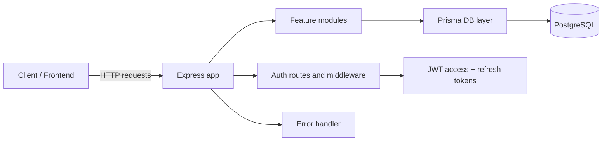

# Server Architecture

This server is the backend for the SyncBoard application. It is built as a TypeScript + Express API with Prisma-backed persistence and JWT-based authentication. The project is intentionally structured around feature modules so it can grow from auth into boards, lists, cards, memberships, and real-time collaboration without becoming a single monolithic file.

## High-level architecture



## Root-level structure

```text
server/
├── app.ts                 # Express app setup and route registration
├── server.ts              # Server bootstrap and graceful shutdown
├── env.ts                 # Environment validation with Zod
├── tsconfig.json          # TypeScript compiler config
├── prisma.config.ts       # Prisma config for contract-powered DB access
├── package.json           # Scripts, dependencies, and build commands
├── .env                   # Local environment variables
├── .env.example           # Template environment variables
├── src/
│   ├── modules/
│   │   ├── auth/          # Register/login/refresh/logout flow
│   │   ├── errors/        # AppError and centralized error handling
│   │   └── users/         # Prepared for user-related logic
│   ├── prisma/
│   │   ├── db.ts          # Prisma/Postgres database client instance
│   │   ├── contract.prisma
│   │   ├── contract.json
│   │   └── contract.d.ts
│   └── types/
│       └── server.ts      # Shared request types and JWT payload types
├── migrations/
│   ├── app/
│   └── snapshots/
├── md guides/
│   └── AUTH_IMPLEMENTATION_GUIDE.md
├── dist/                  # Compiled output from TypeScript build
└── node_modules/
```

## How the server is built

### 1. Runtime stack

The server is a Node.js backend configured as an ES module project.

- Runtime: Node.js + Express
- Language: TypeScript
- Module system: ESM (`"type": "module"`)
- Validation: Zod
- Database: Prisma + PostgreSQL
- Auth: JWT + bcrypt

This is defined in [server/package.json](package.json), which includes these scripts:

```json
"scripts": {
  "dev": "tsx watch ./server.ts",
  "build": "tsc",
  "start": "node dist/server.js",
  "contract:emit": "prisma contract emit"
}
```

### 2. Development flow

During development:

- `tsx watch ./server.ts` starts the server in watch mode
- TypeScript files are executed directly without a separate transpile step
- The app reloads automatically when files change

For a production-style build:

- `tsc` compiles the project into `dist/`
- `node dist/server.js` runs the compiled server

This matches a standard TypeScript backend workflow: fast local iteration in dev, compiled output in production.

### 3. App startup and bootstrapping

The service boots in two layers:

- [server/app.ts](app.ts) creates the Express app and attaches global middleware and route groups
- [server/server.ts](server.ts) starts the HTTP server and listens on the configured port

Current app setup:

```ts
const app = express();
app.use(cors({ origin: env.CORS_ORIGIN }));
app.use(express.json());
app.use('/auth', authRoutes);
app.get('/health', ...);
app.use(errorHandler);
```

The server also handles graceful shutdown:

- listens for `SIGTERM`
- closes the HTTP server
- closes the Prisma DB connection
- exits cleanly

### 4. Environment configuration

The app reads environment values from `.env` and validates them centrally in [server/env.ts](env.ts).

It uses Zod to ensure required values are present and correctly typed, including:

- `NODE_ENV`
- `PORT`
- `DATABASE_URL`
- `CORS_ORIGIN`
- `JWT_ACCESS_SECRET`
- `JWT_REFRESH_SECRET`
- token expiration values

This ensures the app fails fast if configuration is missing or malformed instead of blowing up later in runtime code.

### 5. Feature modularity

The project is organized by feature module under [server/src/modules](src/modules).

#### Auth module

The auth flow is the most complete example of the architecture:

- [server/src/modules/auth/authRoutes.ts](src/modules/auth/authRoutes.ts)
- [server/src/modules/auth/authService.ts](src/modules/auth/authService.ts)
- [server/src/modules/auth/authMiddleware.ts](src/modules/auth/authMiddleware.ts)
- [server/src/modules/auth/authValidator.ts](src/modules/auth/authValidator.ts)

This module handles:

- `POST /auth/register`
- `POST /auth/login`
- `POST /auth/refresh`
- `POST /auth/logout`

The module is split by responsibility:

- route layer: HTTP handling and request validation
- service layer: hashing, token generation, refresh-token rotation
- middleware layer: verifying access tokens on protected routes
- validator layer: schema enforcement with Zod

This is the pattern the rest of the app should follow as new features are added.

#### Error handling

A centralized error layer is implemented in [server/src/modules/errors/errorHandler.ts](src/modules/errors/errorHandler.ts) and [server/src/modules/errors/AppError.ts](server/src/modules/errors/AppError.ts).

The project defines reusable error factories such as:

- `BadRequestError`
- `UnauthorizedError`
- `ForbiddenError`
- `NotFoundError`
- `ConflictError`

The Express error middleware converts them into consistent HTTP responses and also handles Zod validation errors and JWT parsing failures.

### 6. Database layer

The database access layer is defined in [server/src/prisma/db.ts](src/prisma/db.ts).

Important details:

- it imports the generated Prisma contract JSON
- it initializes the Prisma Postgres runtime client
- it exposes `db` as the reusable database instance
- it sets up `Temporal` support for time-based values

The Prisma contract files are kept under [server/src/prisma](src/prisma), which is a strong sign that the project is using a typed, contract-driven DB setup rather than a simple raw SQL style.

The Prisma config lives in [server/prisma.config.ts](prisma.config.ts), which points at the generated contract file and the database connection URL.

### 7. Auth design details

The auth implementation is a good example of the project’s build philosophy:

- passwords are hashed with bcrypt
- access tokens are short-lived and used for requests
- refresh tokens are long-lived and stored as hashed values in the database
- refresh tokens are rotated when reused
- `authMiddleware` verifies bearer tokens before protected routes execute
- validation happens in Zod schemas before business logic runs

This means auth is not just a single endpoint; it is a small system with clear boundaries.

## Pattern we are following

The server is being built with a modular layered structure:

1. `app.ts` wires the application
2. feature route files handle HTTP endpoints
3. validators parse and enforce request payloads
4. services contain business logic
5. Prisma DB access runs data operations
6. middleware enforces auth and permissions
7. error handlers return clean, consistent API error responses

This helps keep responsibilities separate and makes the code easier to test and extend.

## Current status vs. project goal

The existing server currently contains the authentication foundation and the application shell for the broader SyncBoard project. The planned app scope from [REQUIREMENTS.md](../REQUIREMENTS.md) includes:

- boards and memberships
- list/card CRUD and ordering
- permission checks and role-based access
- real-time collaboration
- activity tracking
- concurrency-safe card updates

The current server is therefore a strong base layer, not the full product yet. The project is intentionally being built in phases, starting with the shared backend foundation and security model.

## Summary

The server is designed around a clean backend architecture:

- Express for the API surface
- TypeScript for type safety and compile-time checks
- Zod for validation
- Prisma for database access
- JWT + bcrypt for authentication
- module-based organization for feature growth
- centralized errors and environment validation for operational reliability

This approach gives the project a solid foundation for the larger collaborative Kanban application described in the project requirements.
